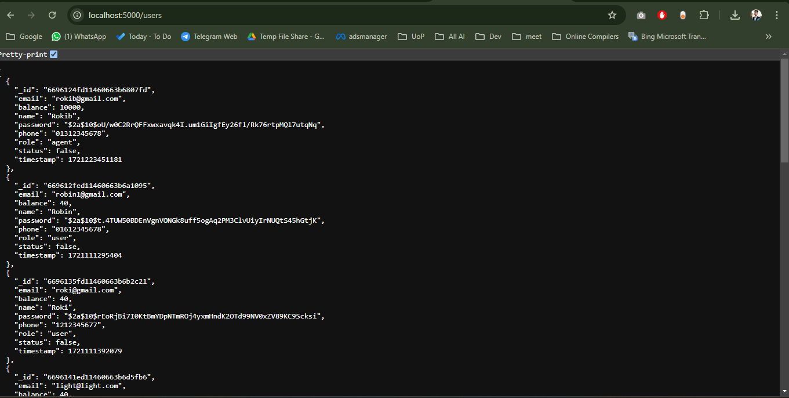

<h1 align="center">AXION PAY Server </h1>


<p align="center">
  
</p>
<br>

Live Server: [Axion-Pay-Server](https://axionpay-server.vercel.app)

Client Repo Link: [AXION-PAY-Client](https://github.com/younusFoysal/Axion-Pay-Client)


## Project Overview
- Project Name: Axion Pay
- Type: Basic Mobile Financial Service (MFS) application
- Technologies Used: React.js, Node.js, Express.js, MongoDB
- Primary Objective: To provide essential MFS functionalities such as user authentication, send money, cash-out, and balance inquiries.
- Focus: Ensuring a simple and secure web interface for users.


## Features
- **User Authentication**: Secure login and registration system.
- **Send Money**: Transfer funds between users.
- **Cash-In Requests**: Submit and manage requests for adding funds.
- **Cash-Out Requests**: Submit and manage requests for withdrawing funds.
- **Balance Inquiry**: Check and refresh account balance.
- **Transaction Management**: View and manage transaction history.


## Technologies Used
```
node
cors
dotenv
express
jsonwebtoken
mongodb
nodemon
bcryptjs
```

## How to Run Locally
1. Clone the repository: `git clone https://github.com/younusFoysal/Axion-Pay-Server.git`
2. Navigate to the project directory: `cd Axion-Pay-Server`
3. Install dependencies: `npm install`
4. Set up environment variables as per `.env`.
5. Start the server: `nodemon index.js`
